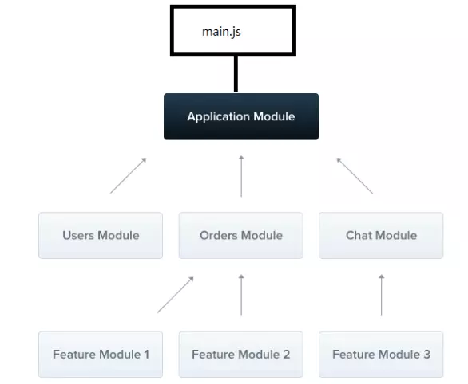

## 什么是NestJS
Nest 是一个渐进的 Node.js 框架，可以在 TypeScript 和 JavaScript (ES6、ES7、ES8)之上构 建高效、可伸缩的企业级服务器端应用程序。

Nest 基于 TypeScript 编写并且结合了 OOP（面向对象编程），FP（函数式编程）和 FRP （函数式响应编程）的相关理念。在设计上的很多灵感来自于 Angular，Angular 的很多模 式又来自于 Java 中的 Spring 框架，依赖注入、面向切面编程等，所以我们也可以认为： Nest 是 Node.js 版的 Spring 框架。

Nest 框架底层 HTTP 平台默认是基于 Express 实现的，所以无需担心第三方库的缺失。 Nest 旨在成为一个与平台无关的框架。 通过平台，可以创建可重用的逻辑部件，开发人员可以利用这些部件来跨越多种不同类型的应用程序。 从技术上讲，Nest 可以在创建适配器 后使用任何 Node HTTP 框架。 有两个支持开箱即用的 HTTP 平台：express 和 fastify。 您 可以选择最适合您需求的产品。

NestJs 的核心思想：就是提供了一个层与层直接的耦合度极小,抽象化极高的一个架构 体系。

官网：https://nestjs.com/
中文网站：https://docs.nestjs.cn/
GitHub: https://github.com/nestjs/nest


## 快速导航

* [Nestjs 的特性](#Nestjs的特性)
* [脚手架nest-cli](#脚手架nest-cli)
* [创建控制器](#创建控制器)
* [Get Post通过方法参数装饰器获取传值](#get-post通过方法参数装饰器获取传值)
* [Swagger集成](#Swagger集成)
* [参数验证](#参数验证)
* [静态资源](#静态资源)
* [模板引擎](#模板引擎)
* [重定向](#重定向)
* [提供者](#提供者)
* [cookie](#cookie)
* [session](#session)
* [上传文件](#上传)
* [中间件](#中间件)
* [管道](#管道)
* [模块](#模块)
* [守卫](#守卫)
* [拦截器](#拦截器)
* [执行顺序](#执行顺序)

### Nestjs的特性

1. 依赖注入容器
2. 模块化封装
3. 可测试性
4. 内置支持 TypeScript
5. 可基于 Express 或者 fastify

### 脚手架nest-cli
1. 安装
> npm i -g @nestjs/cli 或者 cnpm i -g @nestjs/cli 或者 yarn global add @nestjs/cli

2. 创建
> nest new nestdemo

3. 相关指令
```
nest new 名称 创建项目
nest -h/--help 帮助
nest g co 名称 创建控制器
nest g s 名称 创建服务
nest g mi 名称 创建中间件
nest g pi 名称 创建管道
nest g mo 名称 创建模块
nest g gu 名称 创建守卫
```

创建类型指令都可以指定文件路径，而且路径全部是再src目录下面，例如：
nest g co /aaa/bbb/user 则在src下面就会存在一个三级目录，user的目录下
有一个以user命名大写的控制器 UserController.ts文件

注意：凡是以脚手架创建的模块，控制器等等都会自动添加到对应配置位置，不需要手动配置

## 创建控制器
Nest 中的控制器层负责处理传入的请求, 并返回对客户端的响应。
```js
import { Controller, Get } from '@nestjs/common';
@Controller('article')
export class ArticleController { 
    @Get() 
    index(): string { 
        return '这是 article 里面的 index'; 
    } 
    @Get('add') 
    add(): string { 
        return '这是 article 里面的 index'; 
    } 
}
```
关于 nest 的 return： 当请求处理程序返回 JavaScript 对象或数组时，它将自动序列化为 JSON。但是，当它返回一个字符串时，Nest 将只发送一个字符串而不是序列化它。这使响应处理变得简单：只需要返回值，Nest 负责其余部分。

## Get Post通过方法参数装饰器获取传值

1. 基本栗子
nestjs 内置装饰器的时候必须得在@nestjs/common 模块下面引入对应的装饰器
```js
import { Controller, Get, Post } from '@nestjs/common'; 
@Controller('cats') 
export class CatsController { 
    @Post() 
    create(): string { 
        return 'This action adds a new cat'; 
    } 
    @Get() 
    findAll(): string { 
        return 'This action returns all cats'; 
    } 
}
```
> Nestjs 也提供了其他 HTTP 请求方法的装饰器 @Put() 、@Delete()、@Patch()、 @Options()、 @Head()和 @All()

2. Nest中获取请求参数
在 Nestjs 中获取 Get 传值或者 Post 提交的数据的话我们可以使用 Nestjs 中的装饰器来获取
```js
@Request() req 
@Response() res 
@Next() next 
@Session() req.session 
@Param(key?: string) req.params / req.params[key] 
@Body(key?: string) req.body / req.body[key] 
@Query(key?: string) req.query / req.query[key] 
@Headers(name?: string) req.headers / req.headers[name]
```

```js
import { Controller, Get, Post,Query,Body } from '@nestjs/common'; 
@Controller('news') 
export class NewsController { 
    @Get() 
    getAbout(@Query() query): string { 
        console.log(query); 
        //这里获取的就是所有的 Get 传值 
        return '这是 about'
    }

    //针对参数是 localhost:3000/news/list?id=zq&age=12
    @Get('list') 
    getNews(@Query('id') id):string { 
        console.log(id); 
        //这里获取的就是 Get 传值里面的 Id 的值 
        //如果@Query()则是整个id=zq&age=12的对象
        return '这是新闻' 
    }
    @Post('doAdd') 
    async addNews(@Body() newsData){ 
        console.log(newsData); 
        return '增加新闻’'
    } 
}
```

3. 动态路由

```js
// 针对的参数是 /name/id这种类型，例如/name/1
@Get(':id') 
findOne(@Param() params): string { 
    console.log(params.id); 
    return `This action returns a #${params.id} cat`; 
}
```
> 补充： @Param() 装饰器访问以这种方式声明的路由参数，该装饰器应添 加到函数签名中。@Param可以用在get或者post，但是都是针对 localhost:3000/news/list?id=zq&age=12这种才可以获取，而针对body内部都是获取不到的，可以使用@Body

4. 综合案例
```js
@Controller('news')
export class NewsController {
    //依赖注入
    constructor(private readonly newsService:NewsService){}
    @Get('pip')
    @UsePipes(new NewsPipe(useSchema))
    indexPip(@Query() info){
        // console.log(info);
        return info;
    }
    
    @Get()
    @Render('default/news')
    index(){
      return  {
          newsList:this.newsService.findAll()
      }
    }

    /**
     * 路由顺序：如果此时访问http://localhost:3000/news/add
     * 则会正确执行，如果把add移动到:id下面，则只会执行:id的
     */
    @Get('add')
    addData(@Query('id') id){
        return id+'------';
    }

    //同理，这个模糊匹配如果移动到:id下面，访问http://localhost:3000/news/aaa
    //也会只匹配:id的路由
    @Get('a*a')
    indexA(){
        return '模糊匹配';
    }

    //动态路由  /add/1
    @Get(':id')
    indexB(@Param('id') id){
        return id;
    }
}
```

### Swagger集成
中文文档地址：https://docs.nestjs.cn/6/recipes?id=openapi-swagger
- 安装
> npm install --save @nestjs/swagger swagger-ui-express

如果你正在使用fastify，你必须安装 fastify-swagger 而不是 swagger-ui-express
> npm install --save @nestjs/swagger fastify-swagger

- 引导
 - main.ts
 - 引入：import { SwaggerModule, DocumentBuilder } from '@nestjs/swagger';
 - 编码

```js
import { NestFactory } from '@nestjs/core';
import { AppModule } from './app.module';
import { SwaggerModule, DocumentBuilder } from '@nestjs/swagger';

async function bootstrap() {
    const app = await NestFactory.create(AppModule);
    const options = new DocumentBuilder()
        .setTitle('Cats example')
        .setDescription('The cats API description')
        .setVersion('1.0')
        //下面两者结合组成请求基本路径
        .setHost('http://www.baidu.com')
        .setBasePath('/api')
        // .addTag('cats') 分类
        .build();
const document = SwaggerModule.createDocument(app, options);
//指定文档路径
SwaggerModule.setup('api-docs', app, document);
await app.listen(3000);
}
bootstrap();
```
- 打开http://localhost:3000/api-docs/#/

## swagger基本使用
- 创建Dto
```js
import { ApiModelProperty } from '@nestjs/swagger';
export class CreatePostDto{
  @ApiModelProperty({description:"应用名称",example:'示例值'})
  title:string
  @ApiModelProperty({description:"应用内容"})
  content:string
}
```


- @ApiModelProperty() 装饰器接受选项对象
```js
export const ApiModelProperty: (metadata?: {
  description?: string;
  required?: boolean;  //代表是否必须存在该参数
  type?: any;
  isArray?: boolean;
  collectionFormat?: string;
  default?: any;
  enum?: SwaggerEnumType;
  format?: string;
  multipleOf?: number;
  maximum?: number;
  exclusiveMaximum?: number;
  minimum?: number;
  exclusiveMinimum?: number;
  maxLength?: number;
  minLength?: number;
  pattern?: string;
  maxItems?: number;
  minItems?: number;
  uniqueItems?: boolean;
  maxProperties?: number;
  minProperties?: number;
  readOnly?: boolean;
  xml?: any;
  example?: any;
}) => PropertyDecorator;
```
- 完整例子
 > 只是入门，更多例子是使用规则查看文档

```js
import { Controller, Get, Post, Body, Query, Param } from '@nestjs/common';
import { AppService } from './app.service';
import { ApiUseTags, ApiOperation, ApiModelProperty } from '@nestjs/swagger';

class CreatePostDto{
  //默认required都是true，Model上面会有个红色星号，代表必须填写，
  //但是实际上swagger本身不会限制，只是告知作用，swagger本身请求正常
  @ApiModelProperty({description:"应用名称",example:'示例值',maxLength:1,required:false})
  title:string
  @ApiModelProperty({description:"应用内容"})
  content:string
}

@Controller('app')
@ApiUseTags('默认标签')//其实是大分类
export class AppController {
  constructor(private readonly appService: AppService) {}

  @Get('hello')
  @ApiOperation({title:"显示hello"}) //api的title描述/注释
  getHello(@Query() query,@Param() params): any[] {
    return this.appService.getHello();
  }

  @Post('create')
  @ApiOperation({title:"创建应用"})
  createApp(@Body() body:CreatePostDto): CreatePostDto{
    return body;
  }

  @Get(':id')
  @ApiOperation({title:'应用详情'})
  detail(@Param('id') id:number){
      return{
        id
      }
  }
}
```
总结：swagger本身注解只是告知作用，不同于graphql，例如required本身是没什么作用只是告知使用者需要填写，但是实际上需要与否还是程序控制；同理，不论填写不填写swagger都会进行请求，最终结果以逻辑控制为准。

## 参数验证

1. 安装
> npm i class-validator class-transformer --save

2. 启用全局管道
 * main.ts中
> app.useGlobalPipes(new ValidationPipe())

3. 导包
 * 在需要使用参数校验的文件内导入
> import { IsNotEmpty } from 'class-validator'

```js
class CreatePostDto{
  @ApiModelProperty({description:"应用名称",example:'示例值'})
  //**此处就是**
  @IsNotEmpty({message:'我是没填写title属性的时候，返回的给前端的错误信息'})
  title:string
  @ApiModelProperty({description:"应用内容"})
  content:string
}
```
说明： Nest 自带两个开箱即用的管道，即 ==ValidationPipe== 和 ==ParseIntPipe==
## 补充：ParseIntPipe简单使用
> 可把id自动转换成Int类型

```js
@Get(':id')
async findOne(@Param('id', new ParseIntPipe()) id) {
  return await this.catsService.findOne(id);
}
```
总结： 内置管道都支持全局，方法，参数三种级别的使用
[文档链接](https://docs.nestjs.cn/6/pipes?id=%e5%86%85%e7%bd%ae%e7%ae%a1%e9%81%93)

## 静态资源
[官方文档](https://docs.nestjs.com/techniques/mvc)
> app.useStaticAssets('public');

- 栗子
```js
async function bootstrap() {
  //指定平台
  const app = await NestFactory.create<NestExpressApplication>(AppModule);
  //配置静态资源
  //app.useStaticAssets(join(__dirname,'..','public'))
  
  //上面是直接访问http://localhost:3000/a.png
  //下面可以设置虚拟目录http://localhost:3000/public/a.png
  // app.useStaticAssets(join(__dirname,'..','public'),{
  //   prefix:'/public/'
  // })

  //如下方式也可以，因为默认nest会去寻找根目录下面的参数一文件夹
  app.useStaticAssets('public',{
    prefix:'/public/'  
  })
  await app.listen(3000);
}
```
注意：NestFactory.create<NestExpressApplication>(AppModule);指定了范型其实就是Nest的平台，默认使用的是express的平台，因为静态资源涉及平台的选择所以必须指定了。

## 模板引擎
[官方文档](https://docs.nestjs.com/techniques/mvc)
- 安装
> npm i ejs --save

- 配置

```js
app.setBaseViewsDir(join(__dirname, '..', 'views')) // 放视图的文件
app.setViewEngine('ejs');
```
- 完整代码

```js
import { NestFactory } from '@nestjs/core';
import { AppModule } from './app.module';
//静态资源中间件依赖于具体平台，所以可以先引入express
import { NestExpressApplication } from '@nestjs/platform-express';
// import { join } from 'path';

//此时下面如果使用path则就是path.join
// import * as  path from 'path';

async function bootstrap() {
  const app = await NestFactory.create<NestExpressApplication>(AppModule);
  app.useStaticAssets('public',{
    prefix:'/public/'
  })

  //配置模板引擎,需要先安装模板引擎
  // app.setBaseViewsDir(join(__dirname,'..','views'))
  app.setBaseViewsDir('views');
  app.setViewEngine('ejs');
  await app.listen(3000);
}
bootstrap();
```
==注意此处引入path的方式==

- 渲染页面
```js
@Controller('user')
export class UserController {
    @Get()
    @Render('default/user')
    index(){
        //注意一般有render的路由则return值都是给模板引擎使用的
        //所以nest会判断，一般都是对象，返回字符串会报错
        // return '用户中心';
        //此处是字符串key还是直接命名都可以被ejs搜索到
        // return {"name":"zs",age:12}
    }
}
```
说明：default指的是views下面的default文件夹内部的user模板

## 重定向
```js
import { Controller, Get, Post, Body,Response, Render} from '@nestjs/common';
 @Controller('user') 
 export class UserController { 
     @Get() 
     @Render('default/user') 
     index(){ 
         return {"name":"张三"}; 
    }
    @Post('doAdd') 
    doAdd(@Body() body,@Response() res){
         console.log(body); 
         res.redirect('/user'); //路由跳转 
    } 
}
```

## 提供者
几乎所有的东西都可以被认为是提供者 - service, repository, factory, helper 等等。他们都可以通过 constructor注入依赖关系，也就是说，他们可以创建各种关系。但事实上，提供者不过是一个用@Injectable() 装饰器注解的类。
```js
export interface Cat {
  name: string;
  age: number;
  breed: string;
}
```
```js
import { Controller, Get, Post, Body } from '@nestjs/common';
import { CreateCatDto } from './dto/create-cat.dto';
import { CatsService } from './cats.service';

@Controller('cats')
export class CatsController {
    //依赖注入
  constructor(private readonly catsService: CatsService) {}

  @Post()
  async create(@Body() createCatDto: CreateCatDto) {
    this.catsService.create(createCatDto);
  }

  @Get()
  async findAll(): Promise<Cat[]> {
    return this.catsService.findAll();
  }
}
```

## cookie
- 安装
> npm instlal cookie-parser --save

- 在 main.ts 中引入 cookie-parser
> import * as cookieParser from 'cookie-parser'

- 在 main.ts 配置中间件
> app.use(cookieParser());

- 设置 cookie
> res.cookie("name",'zhangsan',{maxAge: 900000, httpOnly: true});

- 获取 Cookies
```js
@Get('getCookies') 
getCookies(@Request() req){ 
    return req.cookies.name; 
}
```
## cookie参数说明

|属性|说明|
 |:-|:-:|
|domain|	域名|
|expires|	过 期 时 间 （ 秒 ） ， 在 设 置 的 某 个 时 间 点 后 该 Cookie 就 会 失 效 ， 如 expires=Wednesday, 09-Nov-99 23:12:40 GMT|
|maxAge|	最大失效时间（毫秒），设置在多少后失效|
|secure|	当 secure 值为 true 时，cookie 在 HTTP 中是无效，在 HTTPS 中才有效|
|path|	表示 cookie 影响到的路，如 path=/。如果路径不能匹配时，浏览器则不发送这 个 Cookie|
|httpOnly|	是微软对 COOKIE 做的扩展。如果在 COOKIE 中设置了“httpOnly”属性，则通 过程序（JS 脚本、applet 等）将无法读取到 COOKIE 信息，防止 XSS 攻击产生|
|signed|	表 示 是 否 签 名 cookie, 设 为 true 会 对 这 个 cookie 签 名 ， 这 样 就 需 要 用 res.signedCookies 而不是 res.cookies 访问它。被篡改的签名 cookie 会被服务器拒绝，并且 cookie 值会重置为它的原始值，说白了==加密==|

### 相关代码
- 设置 cookie
```js
res.cookie('rememberme', '1', { maxAge: 900000, httpOnly: true })
res.cookie('name', 'tobi', { domain: '.example.com', path: '/admin', secure: true }); 
res.cookie('rememberme', '1', { expires: new Date(Date.now() + 900000), httpOnly: true });、
```

- 获取cookie
> req.cookies.name

- 删除 cookie
```js
res.cookie('rememberme', '', { expires: new Date(0)});
res.cookie('username','zhangsan',{domain:'.ccc.com',maxAge:0,httpOnly:true});
```

### 加密cookie
1. 配置中间件的时候需要传参
> app.use(cookieParser('123456'));

2. 设置 cookie 的时候配置 signed 属性
> res.cookie('userinfo','hahaha',{domain:'.ccc.com',maxAge:900000,httpOnly:true,signed:true});

3. signedCookies 调用设置的 cookie
> console.log(req.signedCookies); 说明：加密的cookie使用3这种方式获取

## session
- 安装
> cnpm install express-session --save

- 导入
> import * as session from 'express-session';

- 设置中间件
> app.use(session({ secret: 'keyboard cat', cookie: { maxAge: 60000 }}))

- 使用
```js
设置值 req.session.username = "张三"; 
获取值 req.session.username
```
- 常用参数
```js
app.use(session({ 
secret: '12345', 
name: 'name',
cookie: {maxAge: 60000}, 
resave: false, 
saveUninitialized: true 
}));
```
- 参数说明

|属性|说明|
|:-|:-:|
|secret|	一个 String 类型的字符串，作为服务器端生成 session 的签名|
|name|	返回客户端的 key 的名称，默认为 connect.sid,也可以自己设置|
|resave|	强制保存 session 即使它并没有变化,。默认为 true。建议设置成|
|saveUninitialized|	强制将未初始化的 session 存储。当新建了一个 session 且未设定属性或值时，它就处于 未初始化状态。在设定一个 cookie 前，这对于登陆验证，减轻服务端存储压力，权限控制是有帮助的。（默 认：true）。建议手动添加。|
|cookie|	设置返回到前端 key 的属性，默认值为{ path: ‘/’, httpOnly: true, secure: false, maxAge: null }。|
|rolling	|在每次请求时强行设置 cookie，这将重置 cookie 过期时间（默认：false）|

- 常用方法
```js
req.session.destroy(function(err) { /*销毁 session*/ })
req.session.username='张三'; //设置 
session req.session.username //获取 
session req.session.cookie.maxAge=0; //重新设置 cookie 的过期时间
```

## 上传文件
[官方文档](https://docs.nestjs.com/techniques/file-upload)

#### 单文件上传
```js
import { Controller, Get, Render, Post, Body, UseInterceptors, UploadedFile } from '@nestjs/common';
import { FileInterceptor } from '@nestjs/platform-express';
import { createWriteStream } from 'fs';
import { join } from 'path';

@Controller('upload')
export class UploadController {
    @Post('doAdd')
    @UseInterceptors(FileInterceptor('pic')) //pic对应 <input type="file" name="pic" id="">
    doAdd(@Body() body,@UploadedFile() file){
        // console.log(body);
        // console.log(file);
        let cws=createWriteStream(join(__dirname,'../../public/upload/',`${Date.now()}---${file.originalname}`))
        cws.write(file.buffer);
        return '上传图片成功';
    }
}
```
```html
 <form action="upload/doAdd" method="post" enctype="multipart/form-data">
        <input type="text" name="title" placeholder="新闻标题">
        <br>
        <br>
        <input type="file" name="pic" id="">
        <br>
        <input type="submit" value="提交">
</form>
```
说明：注意enctype="multipart/form-data"属性必须添加

#### 多文件上传
```js
import { Controller, UseInterceptors, Get, Post, Render, Body, UploadedFiles } from '@nestjs/common';
import { createWriteStream } from 'fs';
import { FilesInterceptor } from '@nestjs/platform-express';
import { join } from 'path';
@Controller('uploadmany')
export class UploadmanyController {
    @Post('doAdd')
    //注意此处是FileFieldsInterceptor代表多文件的name不同的拦截器
    // @UseInterceptors(FileFieldsInterceptor([
    //     { name: 'pic1', maxCount: 1 },
    //     { name: 'pic2', maxCount: 1 }
    // ]))

    //注意此处是FilesInterceptor而上面是FileFieldsInterceptor
    @UseInterceptors(FilesInterceptor('pic')) //多个文件name属性相同的情况下
    doAdd(@Body() body, @UploadedFiles() files) {
        for (const file of files) {
            let cws = createWriteStream(join(__dirname, '../../public/upload/', `${Date.now()}---${file.originalname}`))
            cws.write(file.buffer);
        }
        return '上传多个文件成功';
    }
}
```
注意：此处html中的name相同和不同使用的处理方式不同
```html
    <!-- 注意此处上传文件的enctype -->
    <form action="uploadmany/doAdd" method="post" enctype="multipart/form-data">
        <input type="text" name="title" placeholder="新闻标题">
        <br>
        <br>
        <input type="file" name="pic" id="">
        <input type="file" name="pic" id="">
        <br>
        <input type="submit" value="提交">
    </form>
```

## 中间件
中间件就是匹配路由之前或者匹配路由完成做的一系列的操作。中间件中如果想往下 匹配的话，需要写 next()
#### 中间件任务
- 执行任何代码。
- 对请求和响应对象进行更改。
- 结束请求-响应周期。
- 调用堆栈中的下一个中间件函数。
- 如果当前的中间件函数没有结束请求-响应周期, 它必须调用 next() 将控制传递给下一个中间 件函数。否则, 请求将被挂起。
> Nest 中间件可以是一个函数，也可以是一个带有@Injectable()装饰器的类

#### 使用中间件
1. 创建
> nest g middleware init 或 nest g mi init

```js
import { Injectable, NestMiddleware } from '@nestjs/common';
@Injectable()
export class InitMiddleware implements NestMiddleware {
  use(req: any, res: any, next: () => void) {
    console.log(Date());
    next();
  }
}

import { Injectable, NestMiddleware } from '@nestjs/common';
@Injectable()
export class InitMiddleware implements NestMiddleware {
  use(req: any, res: any, next: () => void) {
    console.log(Date());
    next();
  }
}
```
2. 配置中间件
> 在 app.module.ts 中继承 NestModule 然后配置中间件

```js
export class AppModule implements NestModule{
  configure(consumer:MiddlewareConsumer) {

    /**
     * 中间件相关
     */

    //写*表示匹配所有路由
    // consumer.apply(InitMiddleware).forRoutes('*');
    //匹配指定路由
    // consumer.apply(InitMiddleware).forRoutes('news');
    //直接传入控制器:不推荐
    // consumer.apply(InitMiddleware).forRoutes(NewsController);
    // consumer.apply(InitMiddleware).forRoutes({path:'ab*cd',method:RequestMethod.ALL});
    
    //所有路由都匹配InitMiddleware但是UserMiddleware不光匹配InitMiddleware
    //还匹配UserMiddleware
    // consumer.apply(InitMiddleware,logger).forRoutes('*')
    // .apply(UserMiddleware).forRoutes('user')
    
    //都可以添加多个：代表user/news都可以匹配InitMiddleware,UserMiddleware
    // consumer.apply(InitMiddleware,UserMiddleware).
    // forRoutes({path:'user',method:RequestMethod.ALL},{path:'news',method:RequestMethod.ALL})
  }
}
```
3. 多个中间件
> consumer.apply(cors(), helmet(), logger).forRoutes(CatsController);

4. 函数式中间件
```js
export function logger(req, res, next) { 
    console.log(`Request...`); 
    next();
};
```

5. 全局中间件
```js
//全局中间件只能引入函数式中间件，引入类中间件会报错
import { logger} from './middleware/logger.middleware'
const app = await NestFactory.create(ApplicationModule); 
app.use(logger); 
await app.listen(3000);
```
> 全局中间件只能使用函数式中间件


## 管道
Nestjs 中的管道可以将输入数据转换为所需的输出。此外，它也可以处理验证， 当数据不正确时可能会抛出异常。

1. 创建

> nest g pipe news

```js
import { ArgumentMetadata, Injectable, PipeTransform, BadRequestException, HttpStatus } from '@nestjs/common';
import * as Joi from '@hapi/joi';
@Injectable()
export class NewsPipe implements PipeTransform {
  // constructor(private readonly schema:Joi.Schema){
  // }
  constructor(private readonly schema:Joi.Schema){}

  transform(value: any, metadata: ArgumentMetadata) {
    // console.log(value); //value一般都是get/post等请求传递过来的值
    // value.age=30;  如果这样修改之后，控制器里面的数据就变了


    const {error}=this.schema.validate(value);
    if (error) {
      // throw new BadRequestException('Validate failed')
      return error;
    }
    return value;
  }
}
```
2. 使用
> 安装joi: npm i @hapi/joi --save

```js
import { Controller,Get, Param, Query, Render, UsePipes } from '@nestjs/common';
import { NewsService } from './news.service';
import { NewsPipe } from '../pipe/news.pipe';
import * as Joi from '@hapi/joi';

let useSchema:Joi.Schema=Joi.object().keys({
    name:Joi.string().required(),
    age:Joi.number().integer().min(6).max(66).required()
});

@Controller('news')
export class NewsController {
    //依赖注入
    constructor(private readonly newsService:NewsService){}
    @Get('pip')
    @UsePipes(new NewsPipe(useSchema))
    indexPip(@Query() info){
        // console.log(info);
        return info;
    }
    
    
    @Get()
    @Render('default/news')
    index(){
      return  {
          newsList:this.newsService.findAll()
      }
    }

    /**
     * 路由顺序：如果此时访问http://localhost:3000/news/add
     * 则会正确执行，如果把add移动到:id下面，则只会执行:id的
     */
    @Get('add')
    addData(@Query('id') id){
        return id+'------';
    }

    //同理，这个模糊匹配如果移动到:id下面，访问http://localhost:3000/news/aaa
    //也会只匹配:id的路由
    @Get('a*a')
    indexA(){
        return '模糊匹配';
    }

    //动态路由  /add/1
    @Get(':id')
    indexB(@Param('id') id){
        return id;
    }
}
```

## 模块
模块是具有 @Module() 装饰器的类。 @Module() 装饰器提供了元数据，Nest 用它来组织应用 程序结构。

每个 Nest 应用程序至少有一个模块，即根模块。根模块是 Nest 开始安排应用程序树的地方。事实上，根模块可能是应用程序中唯一的模块，特别是当应用程序很小时，但是对于大型程序来说这是没有意义的。在大多数情况下，您将拥有多个模块，每个模块都有一组紧密 相关的功能。

#### @module() 装饰器接受一个描述模块属性的对象
|属性	|描述|
 |:-|:-:|
|providers|	由 Nest 注入器实例化的提供者，并且可以至少在整个模块中共享|
|controllers|	必须创建的一组控制器|
|imports|	导入模块的列表，这些模块导出了此模块中 所需提供者，注意导入的是模块|
|exports|	由本模块提供并应在其他模块中可用的提供 者的子集|

#### 模块共享
- 共享模块：只是一个普通模块

```js
import { Module } from '@nestjs/common';
import { BaseService } from './service/base/base.service';

@Module({
  providers: [BaseService],
  exports:[BaseService]
})
export class ShareModule {}
```
总结：其实就是module内部exports的东西，此时是一个基础服务类(可以是很多)，只要导出了，其他模块只要导入了该模块，则该模块的所有exports的都可以通过依赖注入方式直接使用，而不需要一个个导入service或者provider，然后放到想使用的模块的provider中。

- 使用共享模块

```js
import { Module } from '@nestjs/common';
import { UserController } from './controller/user/user.controller';
import { NewsService } from './service/news/news.service';
import { ShareModule } from '../share/share.module';

@Module({
  imports:[ShareModule],
  controllers: [UserController],
  providers: [NewsService],
})
export class AdminModule {
    
}
```
此时新板块导入了module，没有导入具体外部service例如上面的BaseService，但是可以依赖注入在现在的模块中直接使用。

- 使用共享模块导出的service

```js
import { Controller, Get } from '@nestjs/common';
import {BaseService} from '../../../share/service/base/base.service'

@Controller('admin/user')
export class UserController {
    constructor(private readonly baseService:BaseService){}
    @Get()
    index(){
        console.log(this.baseService.getData());
        return "哈哈"
    }   
}
```

#### 模块总结
由上面可知，其实所有模块都可以导入，只要不出现循环导入就都可以，而模块的概念，加强了约束，即使import导入了对应service，只要没有在对应module导入module，则运行就报错。

## 守卫
[文档](https://docs.nestjs.com/pipes)
守卫是一个使用 @Injectable() 装饰器的类。守卫应该实现 CanActivate 接口。

守卫有一个单独的责任。它们确定请求是否应该由路由处理程序处理。到目前为止，访问限 制逻辑大多在中间件内。这样很好，因为诸如 token 验证或将 request 对象附加属性与 特定路由没有强关联。但中间件是非常笨的。它不知道调用 next() 函数后会执行哪个处 理程序。另一方面，守卫可以访问 ExecutionContext 对象，所以我们确切知道将要执行 什么。

#### 简单说
在 Nextjs 中如果我们想做权限判断的话可以在守卫中完成，也可以在中间件中完成，但是一般通过守卫最好。

- 创建
> nest g gu auth

```js
import { CanActivate, ExecutionContext, Injectable } from '@nestjs/common';
import { Observable } from 'rxjs';

@Injectable()
export class AuthGuard implements CanActivate {
  canActivate(
    context: ExecutionContext,
  ): boolean | Promise<boolean> | Observable<boolean> {
    // let n=Math.random();
    // if (n>0.3) {
    //   return false;
    // }

    //守卫返回false则无法访问路由，true可以

    //判断cookie或者session
    //其实context.switchToHttp().getRequest();就相当于express的req，所以什么path属性等等都有
    // const {cookies,session}=context.switchToHttp().getRequest();
    // console.log(cookies,session);
    
    return true;
  }
}
```

- 使用守卫
```js
@Get('guard') 
@UseGuards(AuthGuard) 
guard(@Query() info){ 
    console.log(info); 
    return `this is guard`; 
}

### 也可以直接加在控制器上面

@Controller('cats') 
@UseGuards(RolesGuard) 
export class CatsController {}

### 全局使用守卫
app.useGlobalGuards(new AuthGuard());
```

- 模块上使用守卫
```js
import {Module} from '@nestjs/common';
import {APP_GUARD} from '@nestjs/core';

@Module({
    providers:[
        {
            provide:APP_GUARD,
            useClass:RolesGuard
        }
    ]
})
export class AppModule{}
```

## 拦截器
- 作用
 - 在函数执行之前/之后绑定额外的逻辑
 - 转换从函数返回的结果
 - 转换从函数抛出的异常
 - 扩展基本函数行为
 - 根据所选条件完全重写函数 (例如, 缓存目的)

- 创建

```js
import { Injectable, NestInterceptor, ExecutionContext, CallHandler } from '@nestjs/common';
import { Observable } from 'rxjs';
import { tap } from 'rxjs/operators';

@Injectable()
export class LoggingInterceptor implements NestInterceptor {
  intercept(context: ExecutionContext, next: CallHandler): Observable<any> {
    console.log('Before...');

    const now = Date.now();
    return next
      .handle()
      .pipe(
        tap(() => console.log(`After... ${Date.now() - now}ms`)),
      );
  }
}
```
由于 handle() 返回一个RxJS Observable，我们有很多种操作符可以用来操作流。在上面的例子中，我们使用了 tap() 运算符，该运算符在可观察序列的正常或异常终止时调用函数。

- 使用

```js
@UseInterceptors(LoggingInterceptor)
export class CatsController {}
```
此处使用LoggingInterceptor，初始化控制反转交给框架本身，虽然可以传入new的实例，但是不建议

- 全局绑定

```js
const app = await NestFactory.create(ApplicationModule);
app.useGlobalInterceptors(new LoggingInterceptor());
```

- 模块绑定

```js
import { Module } from '@nestjs/common';
import { APP_INTERCEPTOR } from '@nestjs/core';

@Module({
  providers: [
    {
      provide: APP_INTERCEPTOR,
      useClass: LoggingInterceptor,
    },
  ],
})
export class ApplicationModule {}
```

[更多使用参照文档](https://docs.nestjs.cn/6/interceptors)

## 执行顺序
> 过滤器详情其实就是异常过滤器，整个流程不见得一定会指定，但是出现异常时候会进入，详情查看官方文档

```
    graph LR
    客户端请求-->中间件
    中间件-->守卫 
    守卫 -->拦截器之前 
    拦截器之前 -->管道
    管道--> 控制器处理并响应
    控制器处理并响应 -->拦截器之后
    拦截器之后 -->过滤器
```
- 接收客户端发起请求
- 中间件去做请求处理，比如helmet，csrf，rate limiting，compression等等常用的处理请求的中间件。
- 守卫就验证该用户的身份，如果没有权限或者没有登录，就直接抛出异常，最适合做权限管理。
- 拦截器根据作者解释，拦截器之前不能修改请求信息。只能获取请求信息。
- 管道做请求的数据验证和转化，如果验证失败抛出异常。
- 这里处理响应请求的业务，俗称controller，处理请求和服务桥梁，直接响应服务处理结果。
- 拦截器之后只能修改响应body数据。
- 最后走过滤器：如果前面任何位置发生抛出异常操作，都会直接走它。

### 总结
模块是按业务逻辑划分基本单元，包含控制器和服务。控制器是处理请求和响应数据的部件，服务处理实际业务逻辑的部件。

中间件是路由处理Handler前的数据处理层，只能在模块或者全局注册，可以做日志处理中间件、用户认证中间件等处理，中间件和express的中间件一样，所以可以访问整个request、response的上下文，模块作用域可以依赖注入服务。全局注册只能是一个纯函数或者一个高阶函数。

管道是数据流处理，在中间件后路由处理前做数据处理，可以控制器中的类、方法、方法参数、全局注册使用，只能是一个纯函数。可以做数据验证，数据转换等数据处理。

守卫是决定请求是否可以到达对应的路由处理器，能够知道当前路由的执行上下文，可以控制器中的类、方法、全局注册使用，可以做角色守卫。

拦截器是进入控制器之前和之后处理相关逻辑，能够知道当前路由的执行上下文，可以控制器中的类、方法、全局注册使用，可以做日志、事务处理、异常处理、响应数据格式等。

过滤器是捕获错误信息，返回响应给客户端。可以控制器中的类、方法、全局注册使用，可以做自定义响应异常格式。

中间件、过滤器、管道、守卫、拦截器，这是几个比较容易混淆的东西。他们有个共同点都是和控制器挂钩的中间抽象处理层，但是他们的职责却不一样。

NestJS很多提供的内部功能，看似功能重复，但是实际上有明确的职责划分，按照约定来，能使结构清晰，代码更好维护
