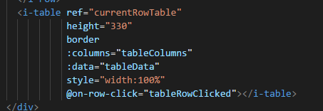
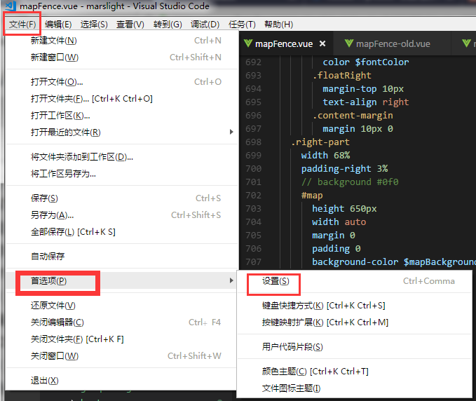
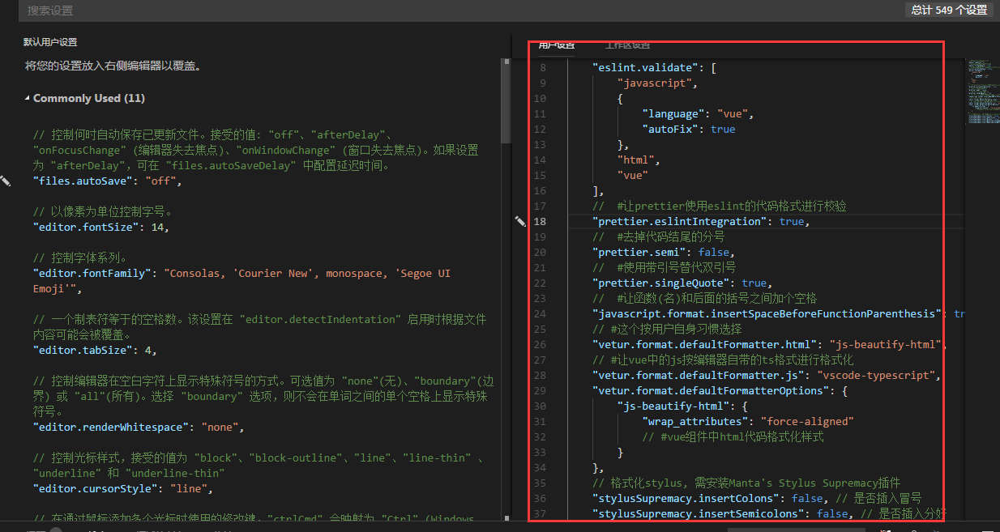

## VScode格式化ESlint-方法（最全最好用方法！）
ESlint：是用来统一JavaScript代码风格的工具，不包含css、html等。

### 背景：
近来研究前端，然后一直在百度上找VScode格式化（ESlint）的插件，结果找了半天都不靠谱。目前没有一个可以格式化html、css、符合ESlint的js、vue的插件，所以自己东拼西凑加实践找到解决方法。

### 解决方案：
#### 安装插件
1. ESlint：javascript代码检测工具，可以配置每次保存时格式化js，但每次保存只格式化一点点，你得连续按住Ctrl+S好几次,才格式化好，自行体会~~
2. vetur：可以格式化html、标准css（有分号 、大括号的那种）、标准js（有分号 、双引号的那种）、vue文件，
但是！格式化的标准js文件不符合ESlint规范，会给你加上双引号、分号等，像这样
 


能把html格式化分行显示
 



3）Prettier - Code formatter：只关注格式化，并不具有eslint检查语法等能力，只关心格式化文件(最大长度、混合标签和空格、引用样式等)，包括JavaScript · Flow · TypeScript · CSS · SCSS · Less · JSX · Vue · GraphQL · JSON · Markdown
4）Manta's Stylus Supremacy： 格式化stylus的插件（不用就不装），因为vetur会把css格式化有分号 、大括号的那种，此插件会把css格式化成stylus风格，像这样
 

 

2、在vscode的文件-首选项-设置里，右侧配置里添加如下代码即可（代码有注释！），从此直接 Ctrl+S 就能一键格式化了
 



 


代码如下：
```json
{
     // vscode默认启用了根据文件类型自动设置tabsize的选项
    "editor.detectIndentation": false,
    // 重新设定tabsize
    "editor.tabSize": 2,
    // #每次保存的时候自动格式化 
    "editor.formatOnSave": true,
    // #每次保存的时候将代码按eslint格式进行修复
    "eslint.autoFixOnSave": true,
    // 添加 vue 支持
    "eslint.validate": [
        "javascript",
        "javascriptreact",
        {
            "language": "vue",
            "autoFix": true
        }
    ],
    //  #让prettier使用eslint的代码格式进行校验 
    "prettier.eslintIntegration": true,
    //  #去掉代码结尾的分号 
    "prettier.semi": false,
    //  #使用带引号替代双引号 
    "prettier.singleQuote": true,
    //  #让函数(名)和后面的括号之间加个空格
    "javascript.format.insertSpaceBeforeFunctionParenthesis": true,
    // #这个按用户自身习惯选择 
    "vetur.format.defaultFormatter.html": "js-beautify-html",
    // #让vue中的js按编辑器自带的ts格式进行格式化 
    "vetur.format.defaultFormatter.js": "vscode-typescript",
    "vetur.format.defaultFormatterOptions": {
        "js-beautify-html": {
            "wrap_attributes": "force-aligned"
            // #vue组件中html代码格式化样式
        }
    },
    // 格式化stylus, 需安装Manta's Stylus Supremacy插件
    "stylusSupremacy.insertColons": false, // 是否插入冒号
    "stylusSupremacy.insertSemicolons": false, // 是否插入分好
    "stylusSupremacy.insertBraces": false, // 是否插入大括号
    "stylusSupremacy.insertNewLineAroundImports": false, // import之后是否换行
    "stylusSupremacy.insertNewLineAroundBlocks": false // 两个选择器中是否换行
}
```
