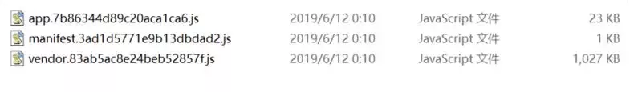
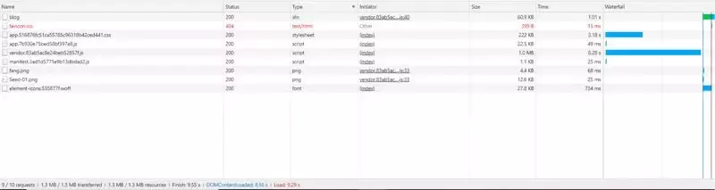
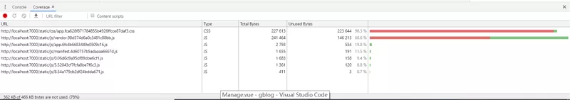
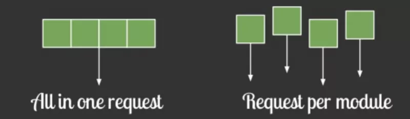
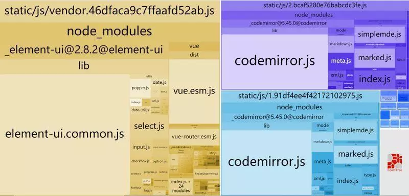
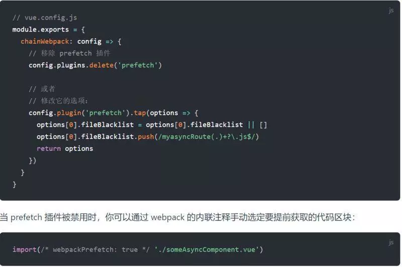
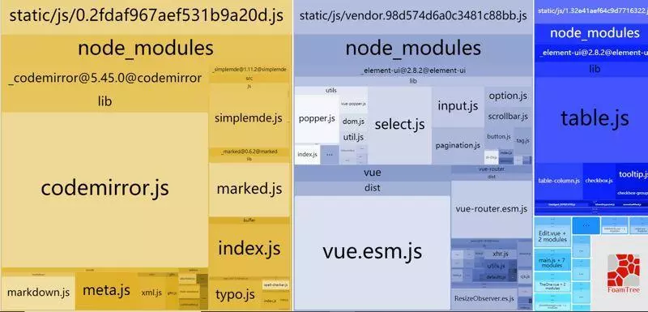
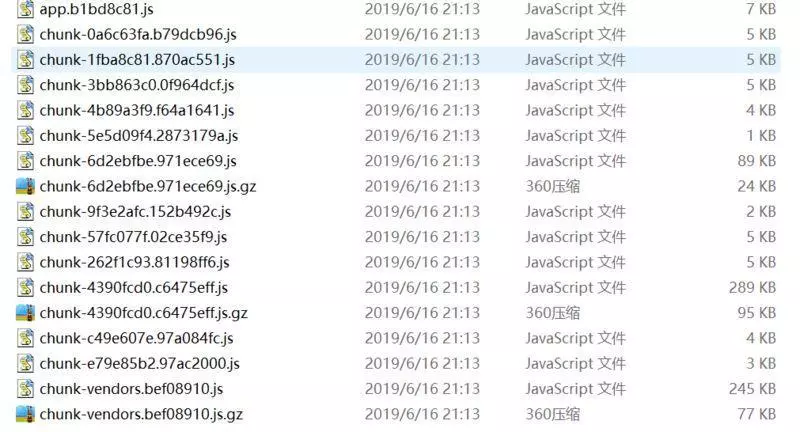
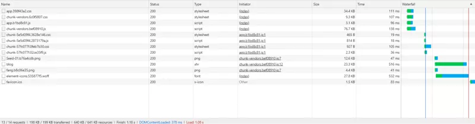
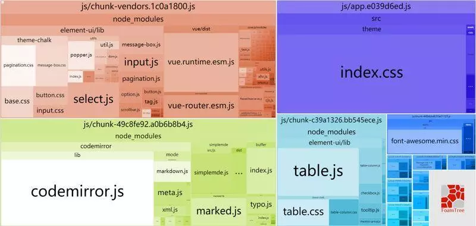

直接 npm run build 打包出来，有一个 1M 的巨大 js 文件


先挂载到服务器上试试
好家伙 这加载时间 仿佛过了半个世纪



首屏页面整整加载了 9s 光加载那个大文件就花了 8s

这必须得做个优化了，没有用户能忍受 9s 的白屏而不关闭页面的

过程中，我还顺便把项目从 vuecli2.x 迁移到了 vuecli3，所以接下来还会介绍一些它们在优化上的异同

分析

vuecli 2.x 自带了分析工具，因此只要运行 npm run build--report 即可。

如果是 vuecli3 的话，先安装插件

> cnpm intall webpack bundle analyzer save dev

然后在 vue.config.js 中对 webpack 进行配置

```js
chainWebpack: (config) => {
  /* 添加分析工具*/
  if (process.env.NODE_ENV === 'production') {
    if (process.env.npm_config_report) {
      config.plugin('webpack-bundle-analyzer')
        .use(require('webpack-bundle-analyzer').BundleAnalyzerPlugin).end();
      config
        .plugins
        .delete('prefetch')
    }
  }
}
```
再运行 `npm run build--report`

这时会在浏览器打开一个项目打包的情况图，便于直观地比较各个  bundle 文件的大小

可以看到，项目中所有的依赖，所有的路由，都被打包进了同一个文件中。

另外，在浏览器中，也可以通[过 converge 来查看代码的使用状况



红色的是下载了但未使用的部分。

## 路由懒加载

> 当[打包构建应用时，JavaScript 包会变得非常大，影响页面加载。如果我们[能把不同路由对应的组件分割成不同的代码块，然后当路由被访问的时[候才加载对应组件，这样就更加高效了。

在一开始就下载完所有路由对应的组件文件，这明显是不合适的，这就像下载[一个 app 了，所以我们就需要使用路由懒加载



在 router.js 文件中，原来的静态引用方式

```js
import ShowBlogs from '@/components/ShowBlogs'
routes:[path:'Blogs',name:'ShowBlogs',component:ShowBlogs]
```

改为

```js
routes:[path:'Blogs',name:'ShowBlogs',component:()=>import('./components/ShowBlogs.vue')]
```

以函数的形式动态引入，这样就可以把各自的路由文件分别打包，只有在解析[给定的路由时，才会下载路由组件



首屏需要加载的文件变成了橙色的部分，被小弟们分流出去了 300k

如果是在 vuecli3 中，我们还需要多做一步工作[因为 vuecli3 默认开启 prefetch(预先加载模块)，提前获取[用户未来可能会访问的内容。

在首屏会把这十几个路由文件，都一口气下载了[所以我们要关闭这个功能，在 vue.config.js 中设置

参考官网的做法：


设置完毕后，首屏就只会加载当前页面路由的组件了

### element-ui按需加载


首屏需要加载的依赖包，其中 element-ui 整整占了 568k

原本的引进方式引进了整个包：
```js
import ElementUI from 'element-ui'
Vue.use(ElementUI)
```

但实际上我用到的组件只有按钮，分页，表格，输入与警告

所以我们要按需引用：

```js
import {Button,Input,Pagination,Table,TableColumn,MessageBox} from'element-ui';
Vue.use(Button)
Vue.use(Input)
Vue.use(Pagination)
Vue.prototype.$alert =MessageBox.alert
```

注意 MessageBox 注册方法的区别，并且我们虽然用到了 alert，但并不需[要引入 Alert 组件

在 .babelrc 文件中添加（vue-cli 3 要先安装 babel-plugin-component)：

```js
plugins: [
  [
    "component", {
      "libraryName": "element-ui",
      "styleLibraryName": "theme-chalk"
    }
  ]
]
```


[element-ui 小了很多，不过看到那个显眼的 table.js 后想到， table [组件只有后台管理页面用到了，不需要全局注册，所以我们删除 main.js [中 Table 和 TablColumn 的引用，并在后台组件中局部注册

```js
import { Table, TableColumn } from "element-ui";

components:{
  "el-table": Table,
  "el-table-column": TableColumn
},
```


table 就被拆分到了路由文件中

### 组件重复打包
可以看到上图，有两个路由文件都引用了 codemirror.js 造成重复下载。[我们可以在 webpack 的 config 文件中，修改 CommonsChunkPlugin 的配置
```js
minChunks:3
```

把 3 改为 2，就会把使用 2 次及以上的包抽离出来，放进公共依赖文件，[不过由于首页也有复用的组件，所以首页也会下载这个公共依赖文件



首[页下载了黄色和灰色部分。拆了半天，又回到原点当然，我们可以继续折腾 CommonsChunkPlugin 的配置来解决这个问题。
但在新版 webpack 中， CommonsChunkPlugin 被自由度更高，更高级的 SplitChunksPlugin 代替
这也是为什么我要把项目迁移到 vuecli 3（使用 webpack4）
因为默认就做了优化，首页只会下载灰色的部分（ 235K）

### gzip

拆完包之后，我们再用 gzip 做一下压缩 安装 compression-webpack-plugin

> nmp i compression-webpack-plugin -D

在 vue.congig.js 中引入并修改 webpack 配置

```js
const CompressionPlugin = require('compression-webpack-plugin')

configureWebpack: (config) => {
  if (process.env.NODE_ENV === 'production') {
    // 为生产环境修改配置...
    config.mode = 'production'
    return {
      plugins: [
        new CompressionPlugin({
          test: /\.js$|\.html$|\.css/,//匹配文件名
          threshold: 10240,//对超过10k的数据进行压缩
          deleteOriginalAssets: false //是否删除原文件
        })]
    }
  }
}
```



可以看到 200k 以上的文件被压缩到了 100k 以内

在服务器我们也要做相应的配置

如果发送请求的浏览器支持 gzip，就发送给它 gzip 格式的文件

我的服务器是用 express 框架搭建的，只要安装一下 compression 就能使用
```js
const compression = require('compression')
app.use(compression())
```
注[意，后面这一句，要放在所有其他中间件注册之前

最终效果


首屏加载资源 198k，加载时间 1s，相比原来速度提升了 90%

后记：css是否要拆分

vuecli 3 和 vuecli2.x 还有一个区别是

 - vuecli 3会默认开启一个 css 分离插件 ExtractTextPlugin

每一个模块的 css 文件都会分离出来，整整 13 个 css文件，而我们的首[页就请求了 4 个，花费了不少的资源请求时间。

我们可以在 vue.config.js 中关闭它

```js
css: {
  // 是否使用css分离插件 ExtractTextPlugin
  extract: false,

    // 开启 CSS source maps?
    sourceMap: false,

    // css预设器配置项
    loaderOptions: { },

    // 启用 CSS modules for all css / pre-processor files.
    modules: false
},
```





打包出来的文件中，直接就没有了 css 文件夹

取而代之的是整合起来的一个 js 文件，负责在一开始就注入所有的样式。

首屏加载文件数减少，但体积变大，最终测下来速度没有太大差异。

所以，是否要 css [拆分就见仁见智，具体项目具体分析吧。

### 总结
性能优化是一个非常令人愉悦的过程，同时也是个深坑，有着太多东西，本篇文章开了个头，希望能对大家有所帮助。